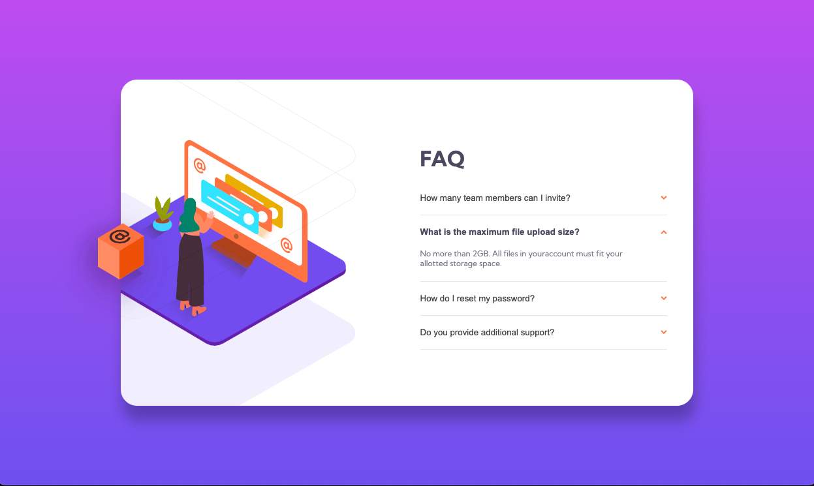

# Frontend Mentor - FAQ accordion card solution

This is a solution to the [FAQ accordion card challenge on Frontend Mentor]

## Table of contents

- [Overview](#overview)
  - [The challenge](#the-challenge)
  - [Screenshot](#screenshot)
  - [Links](#links)
- [My process](#my-process)
  - [Built with](#built-with)
  - [What I learned](#what-i-learned)
  - [Continued development](#continued-development)
  - [Useful resources](#useful-resources)
- [Author](#author)

## Overview

### The challenge

Users should be able to:

- View the optimal layout for the component depending on their device's screen size
- See hover states for all interactive elements on the page
- Hide/Show the answer to a question when the question is clicked

### Screenshot




### Links

- Solution URL: [Add solution URL here](https://your-solution-url.com)
- Live Site URL: [Add live site URL here](https://your-live-site-url.com)

## My Process

### Built with

- Normal HTML5 markup
- CSS custom properties
- Flexbox
- [React](https://reactjs.org/) - JS library
- Media queries

### What I learned

- In CSS:

* I learnt that i could use svg in as a backgraound image rather than an absolute element.
* also i can insert n number of svg in one background-image property

- In Javascript:

* I could use [(prev) => !prev] to reference the prev value and negate it to be set to a new value.

To see how you can add code snippets, see below:

```css
.card-con {
  background-image: url("/src/images/bg-pattern-desktop.svg"),
    url("/src/images/wd.svg");
  background-repeat: no-repeat, no-repeat;
  background-position: left -340px top -100px, left -70px center;
  background-size: 700px, 415px;
}
```

```js
const togler = () => {
  setToggle((prev) => !prev);
};
```

### Continued development

This may seem like a beginner's concern, i have doubts in setting a div to be the size of a whole page or window. The way i go about this is to set the main div to abosulte with height and width of 100vh and 100vw and set the inner div to position relative. which i found was incorrect to set a fixed size. so i searched and found that i have to set the body element to min-height:100vh and width to 100% and set main div to width and height of 100%. As a result, the body element became the size of the window size but the main div did not. you could see example of this in my css code. I would really appreciate if anyone can explain this to me. Also what could be a good practice go about this. Thanks:)

### Useful resources

- [Example resource 1](https://www.w3schools.com/howto/howto_js_accordion.asp) - This helped me to create an accordian from scratch
- I use Figma to help create shadow-box on certain elements

## Author

- Website - [Basma Tebe](https://www.your-site.com)
- Frontend Mentor - [@btebe](https://www.frontendmentor.io/profile/btebe)
